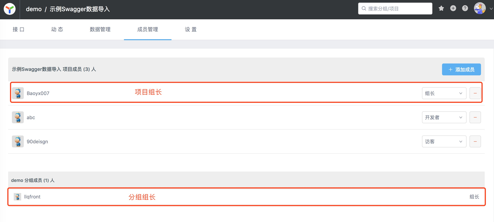
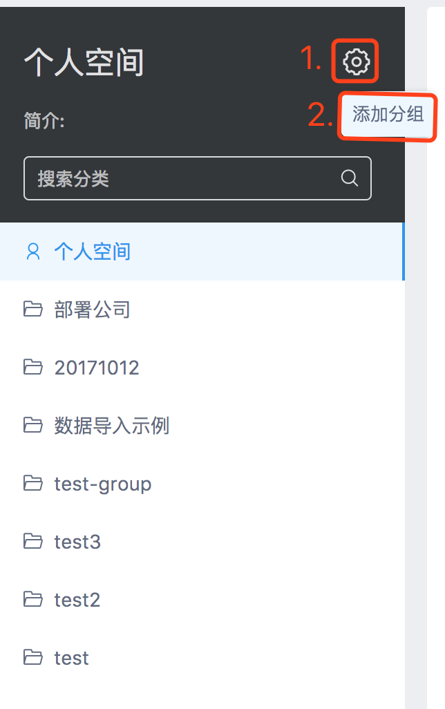

# 权限权利

接口管理的逻辑较为复杂，操作频率高，层层审批将严重拖慢生产效率，因此传统的金字塔管理模式并不适用。

YApi 将扁平化管理模式的思想引入到产品的权限管理中，`超级管理员` 拥有最高的权限，并将权限分配给若干 `管理员`，`超级管理员` 只需管理`管理员` 即可，实际上管理YAPI各大分组与项目的是“`管理员`”。`管理员`对分组或项目负责，一般由BU负责人/项目负责人担任。

## 认识管理员

管理员分为 `分组管理员` 与 `项目管理员`，他们的关系就是 一个分组内有若干 `分组管理员` ，这些 `分组管理员` 在创建项目时就可以指定 `项目管理员`。因此他们在职责上的区别就在于 `分组管理员` 对分组负责 `项目管理员` 对项目负责，二者其他具体区别如下：

`分组管理员` 的权限包括修改分组、删除分组、创建分组下的项目。一般来说，`分组管理员` 只需要对项目负责，将项目的操作任务安排给 `项目管理员` 处理即可。

`项目管理员` 只属于某一个项目因此它无法操作项目所属分组，但拥有项目的全部权限，`项目管理员` 是 YApi 的基层管理者，承担了 YApi 绝大部分的日常管理工作。

## 创建分组
只有 `超级管理员` 有权限创建分组

## 创建项目
成为 `分组成员`，即可在分组中创建项目。

> 想成为 `分组管理员` ，在分组成员列表中找到 `分组管理员`，联系 `分组管理员` 将你设置为分组管理员。

[怎样联系管理员？](./qa.md#q1-怎样联系管理员？)

## 权限列表

新用户未加入项目或分组时，我们称为 `“游客”`。

### 项目权限

| 操作 | 游客 | 项目开发者 | 项目管理员 | 超级管理员 |
| :-------------- | :------------: | :------------: | :------------: | :------------: |
| 浏览公开项目与接口 | ✓ | ✓ | ✓ | ✓ |
| 浏览私有项目与接口 |   | ✓ | ✓ | ✓ |
| 编辑项目信息 |   | ✓ | ✓ | ✓ |
| 新建接口    |   | ✓ | ✓ | ✓ |
| 编辑接口    |   | ✓ | ✓ | ✓ |
| 编辑项目头像 |   |   | ✓ | ✓ |
| 删除项目    |   |   | ✓ | ✓ |

### 分组权限

| 操作 | 游客 | 分组开发者 | 分组管理员 | 超级管理员 |
| :-------------- | :------------: | :------------: | :------------: | :------------: |
| 浏览分组        | ✓ | ✓ | ✓ | ✓ |
| 在分组中新建项目 |   | ✓ | ✓ | ✓ |
| 编辑分组信息     |   |   | ✓ | ✓ |
| 管理分组成员     |   |   | ✓ | ✓ |
| 删除分组        |   |   | ✓ | ✓ |
